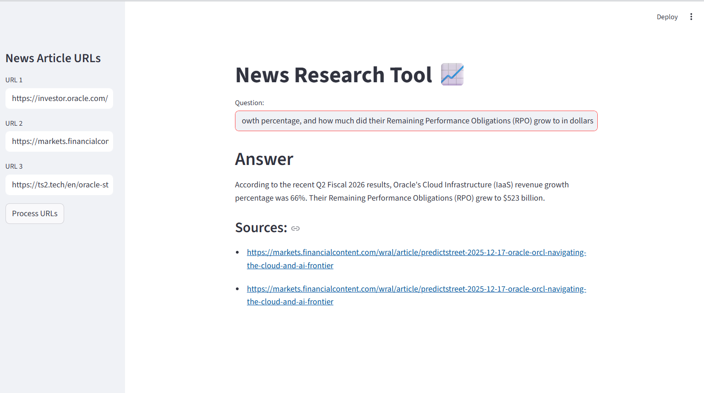

# News Research Tool 📈

**News Research Tool** is a user-friendly application designed for effortless information retrieval from online news articles. Users can input article URLs and ask questions to receive relevant insights from the stock market and financial domain without reading the entire text.

### Application Walkthrough

Here is a walkthrough of the application in action, showing how it processes the Oracle news URLs to provide an answer and its sources:



## Features

* **Load URLs**: Fetch article content directly from web URLs.
* **LangChain Integration**: Process content using `UnstructuredURLLoader` and split text efficiently with `RecursiveCharacterTextSplitter`.
* **Free & Fast Embeddings**: Construct embedding vectors using **HuggingFace Embeddings (`all-MiniLM-L6-v2`)**—running locally and for free on your CPU.
* **High-Speed Inference**: Interact with the **Groq LLM (`llama-3.3-70b-versatile`)** for lightning-fast answers.
* **Vector Search**: Leverage **FAISS** for swift similarity search and effective retrieval of relevant information.
* **Modern Architecture**: Built using the 2025 LangChain "LCEL" standard (LangChain Expression Language) for robust pipelines.

## Usage

1. **Run the Streamlit app:**
   ```bash
   streamlit run main.py
   
2. **Using the App:**
   * The web app will open in your browser.
   * On the sidebar, paste up to 3 news article URLs.
   * Click **"Process URLs"** to start loading, splitting, and embedding the data.
   * Wait for the "Processing Complete!" success message.
   * Type your question in the main text box to get an answer based *only* on the provided articles.

## Example Articles

You can test the tool with these sample articles regarding Oracle's 2025 performance:

* [Oracle Q2 Fiscal 2026 Results](https://investor.oracle.com/investor-news/news-details/2025/Oracle-Announces-Fiscal-Year-2026-Second-Quarter-Financial-Results/default.aspx)
* [Oracle Cloud & AI Frontier Analysis](https://markets.financialcontent.com/wral/article/predictstreet-2025-12-17-oracle-orcl-navigating-the-cloud-and-ai-frontier)
* [Oracle & TikTok Joint Venture News](https://ts2.tech/en/oracle-stock-orcl-news-and-forecast-on-dec-20-2025-tiktok-joint-venture-rally-collides-with-ai-data-center-spending-questions/)

## Sample Questions

Once you have processed the URLs above, try asking these questions to see the RAG tool in action:

1. **"What was the growth rate of Oracle's Cloud Infrastructure (IaaS) in Q2?"**
2. **"How much did their Remaining Performance Obligations (RPO) grow to in dollars?"**
3. **"Which partners are joining Oracle to bid for TikTok's U.S. operations?"**

## Project Structure

* `main.py`: The main Streamlit application script containing the UI and RAG pipeline logic.
* `requirements.txt`: A list of required Python packages (Streamlit, LangChain, Groq, FAISS, etc.).
* `vector_index.pkl`: The pickle file where the FAISS vector index is stored locally.
* `.env`: Configuration file for securely storing your `GROQ_API_KEY`.