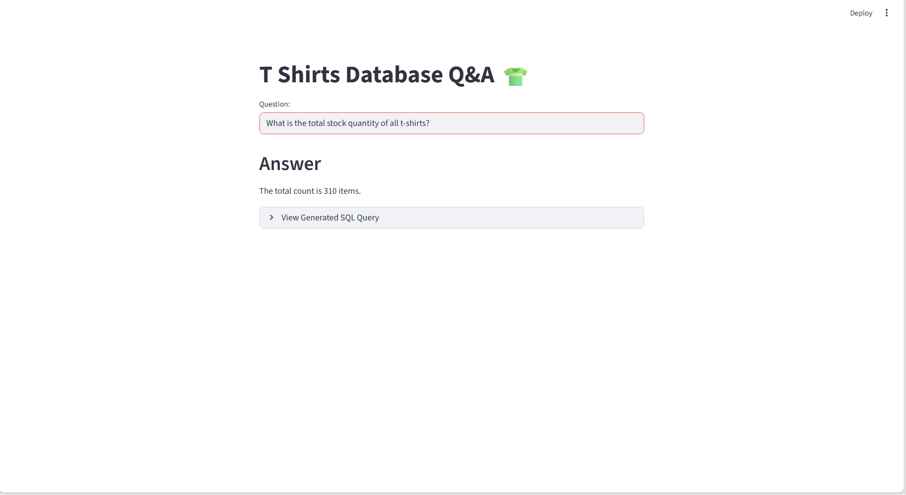

# 👕 T-Shirt Store: Talk to a Database



This is an end-to-end LLM project built using **Groq (Llama 3)**, **LangChain**, and **Streamlit**. We are building a system that allows users to "talk" to a MySQL database in plain English.

The system takes natural language questions, converts them into valid SQL queries, executes them on a **TiDB (MySQL-compatible)** cloud database, and returns the answer in a natural sentence. This tool is designed for store managers to query inventory, sales, and discount data without needing to write a single line of SQL code.

### Example Queries:
* *"How many white Nike t-shirts do we have left in XS size?"*
* *"If we sell all Levi's t-shirts today with discounts applied, how much revenue will our store generate?"*

---

## 🚀 Project Highlights

* **Dynamic SQL Generation:** Translates English questions into complex SQL queries (including `JOINs`, `SUM`, and logic for discounts).
* **Tech Stack:**
    * **LLM:** Groq (Llama 3.3 70B Versatile) for ultra-fast inference.
    * **Database:** TiDB Cloud (MySQL compatible).
    * **Framework:** LangChain (SQLDatabaseChain).
    * **Vector Store:** ChromaDB (for Few-Shot Learning).
    * **Embeddings:** Hugging Face (`sentence-transformers/all-MiniLM-L6-v2`).
    * **UI:** Streamlit.
* **Few-Shot Learning:** Uses a vector database to feed the LLM examples of similar past questions, significantly improving accuracy on complex queries.

---

## 📂 Project Structure

* **`main.py`**: The entry point for the Streamlit application. It handles the UI and displays answers.
* **`langchain_helper.py`**: Contains the core logic for the LangChain pipeline, database connection, and LLM initialization.
* **`tshirts_llm.ipynb`**: A Jupyter Notebook used for initial experimentation, testing the LLM chains, and debugging logic before moving it to the main app.
* **`few_shots.py`**: A list of example questions and their corresponding SQL queries used for "Few-Shot Learning" to train the model contextually.
* **`requirements.txt`**: List of all Python dependencies.
* **`.env`**: Configuration file for storing sensitive API keys and database credentials.
* **`tshirt.png`**: Screenshot of the application user interface.

---

## 🛠️ Installation

1.  **Clone the repository:**
    ```bash
    git clone [https://github.com/your-username/tshirt-store-qa.git](https://github.com/your-username/tshirt-store-qa.git)
    cd tshirt-store-qa
    ```

2.  **Install dependencies:**
    ```bash
    pip install -r requirements.txt
    ```

3.  **Set up Environment Variables:**
    Create a `.env` file in the root directory and add your credentials:
    ```env
    GROQ_API_KEY="your_groq_api_key"
    
    # Database Credentials (TiDB / MySQL)
    DB_USER="your_db_user"
    DB_PASSWORD="your_db_password"
    DB_HOST="your_tidb_host_address"
    DB_PORT="4000"
    DB_DATABASE="your_database_name"
    ```

---

## ▶️ Usage

### Running the Web App
To start the user interface:
```bash
streamlit run main.py